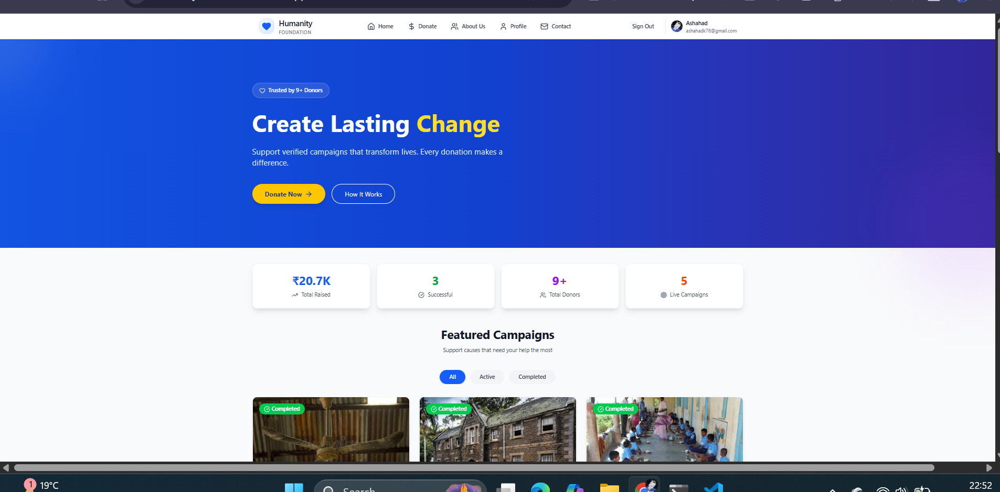
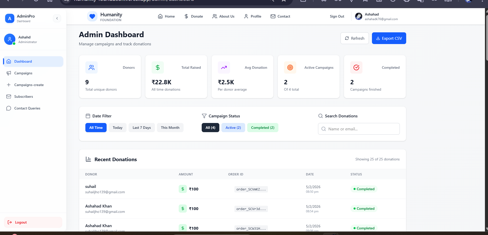
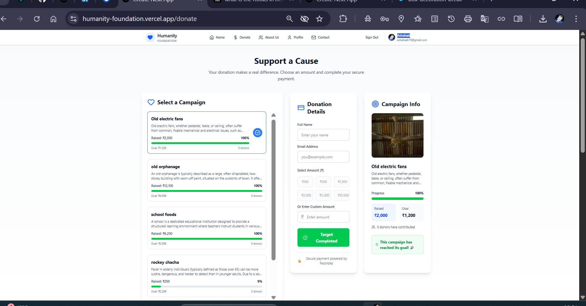

# 🌍 Humanity Foundation

> A production-ready full-stack donation and campaign management platform connecting compassionate donors with verified causes.

[](https://humanity-foundation.vercel.app)
[](https://nextjs.org)
[](https://mongodb.com)
[](https://vercel.com)

---

## 🚀 Live Demo

🔗 **[https://humanity-foundation.vercel.app](https://humanity-foundation.vercel.app)**

---

## ✨ Features

### 👤 User Side
- 🔐 **Google OAuth Authentication** — Secure sign-in via Google
- 💳 **Razorpay Payment Gateway** — UPI, Cards, Net Banking, Paytm, PhonePe
- 📧 **Email Receipts** — Automatic donation receipts via Nodemailer
- 📋 **Campaign Browsing** — View active & completed campaigns
- 👤 **User Profile** — Donation history and account management
- 📱 **Fully Responsive** — Mobile-first design

### 🛡️ Admin Side
- 🔒 **Secure Admin Panel** — JWT-based auth with middleware-protected routes
- 📊 **Real-time Dashboard** — Donors, Total Raised, Avg Donation, Campaign stats
- 📁 **Campaign Management** — Create, Edit, manage campaigns
- 🖼️ **Media Upload** — Cloudinary integration for image management
- 📤 **Export CSV** — Download donation data
- 🔍 **Search & Filter** — Filter by date, campaign status, donor name/email
- 👥 **Subscriber Management** — Newsletter subscriber list
- 📩 **Contact Queries** — Manage user inquiries

---

## 🔧 Tech Stack

| Layer | Technology |
|-------|-----------|
| **Frontend** | Next.js 15 (App Router) |
| **Backend** | Next.js API Routes |
| **Database** | MongoDB Atlas |
| **Authentication** | JWT + Google OAuth |
| **Media Storage** | Cloudinary |
| **Payments** | Razorpay |
| **Email** | Nodemailer |
| **Styling** | Tailwind CSS |
| **Deployment** | Vercel |

---

## 📁 Project Structure

```
humanity-foundation/
├── src/
│   ├── app/
│   │   ├── (auth)/          # Auth pages
│   │   ├── admin/           # Admin dashboard & routes
│   │   ├── api/             # API routes
│   │   ├── donate/          # Donation pages
│   │   ├── about/           # About page
│   │   ├── contact/         # Contact page
│   │   └── user/            # User profile
│   ├── components/          # Reusable components
│   ├── lib/                 # DB connection, utilities
│   └── middleware.js        # Route protection
├── public/                  # Static assets
├── .env.example             # Environment variables template
└── next.config.mjs
```

---

## ⚙️ Getting Started

### Prerequisites
- Node.js 18+
- MongoDB Atlas account
- Razorpay account
- Cloudinary account
- Google OAuth credentials

### Installation

```bash
# 1. Clone the repository
git clone https://github.com/ashahadk76-cmd/humanity-foundation.git

# 2. Navigate to project
cd humanity-foundation

# 3. Install dependencies
npm install

# 4. Setup environment variables
cp .env.example .env.local
# Fill in your credentials in .env.local

# 5. Run development server
npm run dev
```

Open [http://localhost:3000](http://localhost:3000) in your browser.

---

## 🔐 Environment Variables

Create a `.env.local` file in root directory:

```env
# MongoDB
MONGODB_URI=your_mongodb_connection_string

# JWT
JWT_SECRET=your_jwt_secret_key

# Google OAuth
GOOGLE_CLIENT_ID=your_google_client_id
GOOGLE_CLIENT_SECRET=your_google_client_secret

# Razorpay
RAZORPAY_KEY_ID=your_razorpay_key_id
RAZORPAY_KEY_SECRET=your_razorpay_secret

# Cloudinary
CLOUDINARY_CLOUD_NAME=your_cloud_name
CLOUDINARY_API_KEY=your_api_key
CLOUDINARY_API_SECRET=your_api_secret

# Nodemailer
NODEMAILER_EMAIL=your_email@gmail.com
NODEMAILER_PASSWORD=your_app_password

# Next Auth
NEXTAUTH_SECRET=your_nextauth_secret
NEXTAUTH_URL=http://localhost:3000
```

---

## 📸 Screenshots

### 🏠 Home Page


### 📊 Admin Dashboard


### 💳 Donation Page


---

## 🧠 Key Learnings

Building this project strengthened my understanding of:

- **Server vs Client Components** in Next.js 15 App Router
- **Multipart FormData** handling in production API routes
- **JWT authentication** with middleware-based route protection
- **Payment gateway integration** with Razorpay webhook handling
- **Transactional email** system with Nodemailer
- **Cloud media management** with Cloudinary
- **Environment variable** management across dev & production
- **Debugging** build-time and deployment issues on Vercel

---

## 🚀 Deployment

This project is deployed on **Vercel**.

```bash
# Build for production
npm run build

# Start production server
npm start
```

---

## 📊 Project Stats

- ✅ **25+ Donations** processed
- ✅ **9+ Unique Donors**
- ✅ **₹22.8K+ Total Raised**
- ✅ **4 Campaigns** managed
- ✅ **100% Secure** — SSL Encrypted
- ✅ **80G Tax Benefits** eligible

---

## 🤝 Contributing

Contributions, issues and feature requests are welcome!

1. Fork the project
2. Create your feature branch (`git checkout -b feature/AmazingFeature`)
3. Commit your changes (`git commit -m 'feat: add AmazingFeature'`)
4. Push to the branch (`git push origin feature/AmazingFeature`)
5. Open a Pull Request

---

## 📄 License

This project is open source and available under the [MIT License](LICENSE).

---

## 👨‍💻 Author

**Ashahad Khan**

[](https://linkedin.com/in/your-profile)
[](https://github.com/ashahadk76-cmd)

---

## ⭐ Show Your Support

Agar ye project helpful laga toh **star** zaroor do! ⭐

---

*Built with ❤️ for social impact*
